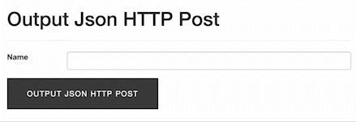

# Output Json HTTP Post

>
> 
>
> This navigation bar was built using [Bootstrap](https://getbootstrap.com/).
>

## Here are using the languages as below.
- [x] PHP
- [x] HTML
- [x] CSS
- [x] JQuery / Ajax

In this tutorial shows how to make a POST request with JSON content body, and return results from server. 
The following example posts a form using Ajax and put results in a div. The `data.php` will process the inputs that the AJAX call sent and return the data object that was created.

```JavaScript
$.ajax({
	url: 'data.php',
	type: 'POST',
	dataType: 'json',
	data: data,
	success: function(data) {
		$('#post_msg').text(data.html);
	}
});
```

`AJAX post settings`
Parameter | Definition
:---: | :---:
`url` | The address to which the request should be sent
`type` | **POST**  or  **GET**
`dataType` | The format (*xml*,*html*,*json*,*jsonp*,*script*,*text*), you expected from server return
`data` | **Plaintext Object**  or  **String**
`success` | server response after success

## <sub><sup>:warning:</sub></sup> Important

>
> `GET` may be considered slightly faster in that it contains less overhead, but the difference should be essentially negligible. The difference between the two is based on other factors.
>
> **DON'T** use `GET` for an operation which alters data. If a search engine crawls a link to your evil op, or the client bookmarks it could causes some serious **T**-**R**-**O**-**U**-**B**-**L**-**E**.
>
